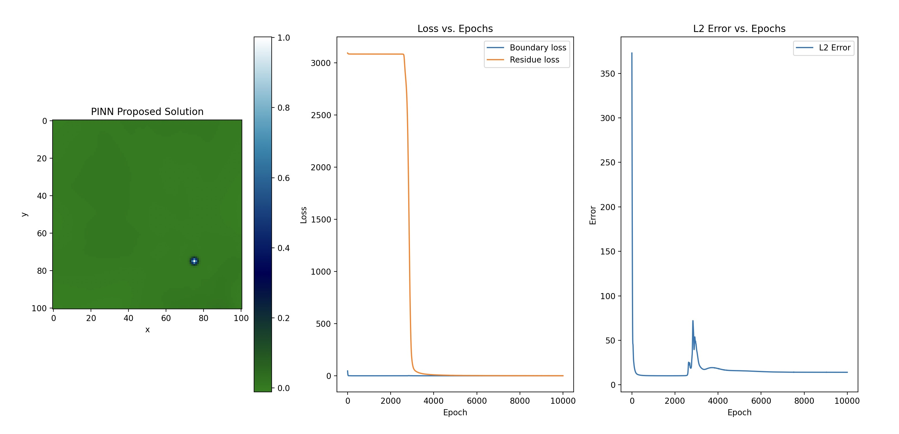
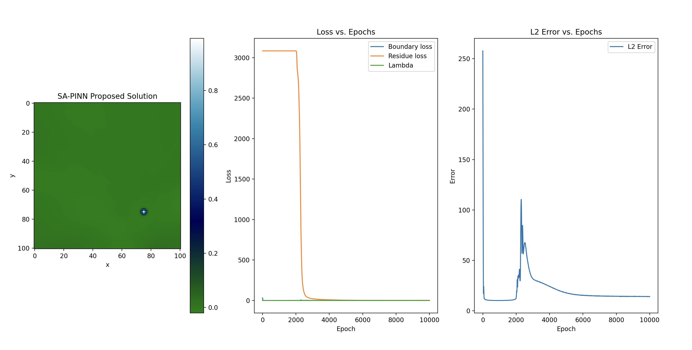
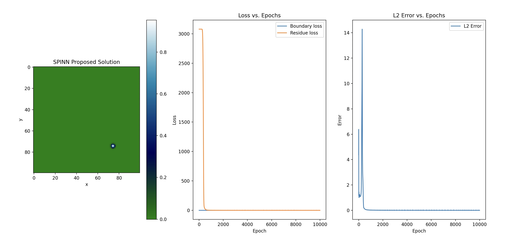

# SPINNs
- M. Beekenkamp, A. Bhagavathula, P. LaDuca.

## Introduction
Separable Physics Informed Neural Networks (SPINNs), originally proposed in the paper “Separable PINN: Mitigating the Curse of Dimensionality in Physics-Informed Neural Networks.” by Cho et al., are an architectural overhaul of conventional PINNs that can approximate solutions to partial differential equations (PDEs). These architectural changes allow the authors to leverage forward-mode autodifferentiation (AD) and operate on a per-axis basis. Compared to conventional PINNs, which use point-wise processing, SPINNs presents a notable reduction in training time whilst maintaining accuracy.  

Although referenced in the paper, Cho et al. did not release the [original code](https://github.com/stnamjef/SPINN) until after we completed this problem. This repository is our implementation of the architecture proposed by the authors. By looking at a 2 dimensional heat equation, we show the improvements described in the paper.

## Results

The performance of the Simple PINN, SA-PINN, and SPINN models were evaluated using $100^2$ collocation points and an architecture with 3 hidden layers of 20 hidden features per layer. The Adam optimizer with a learning rate of 0.0005 was used for all models, and each experiment was trained for 10,000 iterations. All experiments were conducted with a full batch, and the average relative $L_2$ error between the predicted solution ($\hat u$) and the reference solution ($u$) was used as the error metric. The $L_2$ error was calculated using the formula $\frac{\left\Vert\hat u - u\right\Vert^2}{\left\Vert u \right\Vert^2}$. Each experiment was repeated five times using different random seeds.

|Algorithm|Total Loss|$L_2$ Error|Time [ms/iter]|
|:-:|:-|:-|:-|
|Simple PINN|$0.71 \pm 0.33$|$14.43 \pm 0.43$|$26.30 \pm 0.083$|
|SA-PINN|$0.64 \pm 0.19$|$14.22 \pm 0.21$|$28.09 \pm 0.063$|
|S-PINN|$0.059 \pm 0.015$|$0.0099 \pm 0.0065$|$0.93 \pm 0.024$|

The table above summarises the results obtained for the three different network architectures. As shown in the table, the SPINN model achieved the best performance across all the metrics used for the benchmarking process. The SPINN model achieved a total loss of $0.059 \pm 0.015$ and an $L_2$ error of $0.0099 \pm 0.0065$, which is significantly better than the Simple PINN and SA-PINN models. The total loss for the Simple PINN and SA-PINN models were $0.71 \pm 0.33$ and $0.64 \pm 0.19$, respectively, while their $L_2$ errors were $14.43 \pm 0.43$ and $14.22 \pm 0.21$, respectively.  

The images show the error plots for the Simple PINN, SA-PINN, and SPINN models, respectively. These plots show that the SPINN model achieved the lowest error throughout the training process. Additionally, the convergence of the SPINN model was significantly faster than the Simple PINN and SA-PINN models, as shown in the time per iteration column in Table 1. Moreover, where the Simple PINN and SA-PINN struggled with over-fitting the SPINN model kept optimising relative to reference solution.

 
 
 

## Motivating Literature and Sources
Cho, Junwoo, et al. ["Separable PINN: Mitigating the Curse of Dimensionality in Physics-Informed Neural Networks."](https://arxiv.org/abs/2211.08761) arXiv preprint arXiv:2211.08761 (2022).
